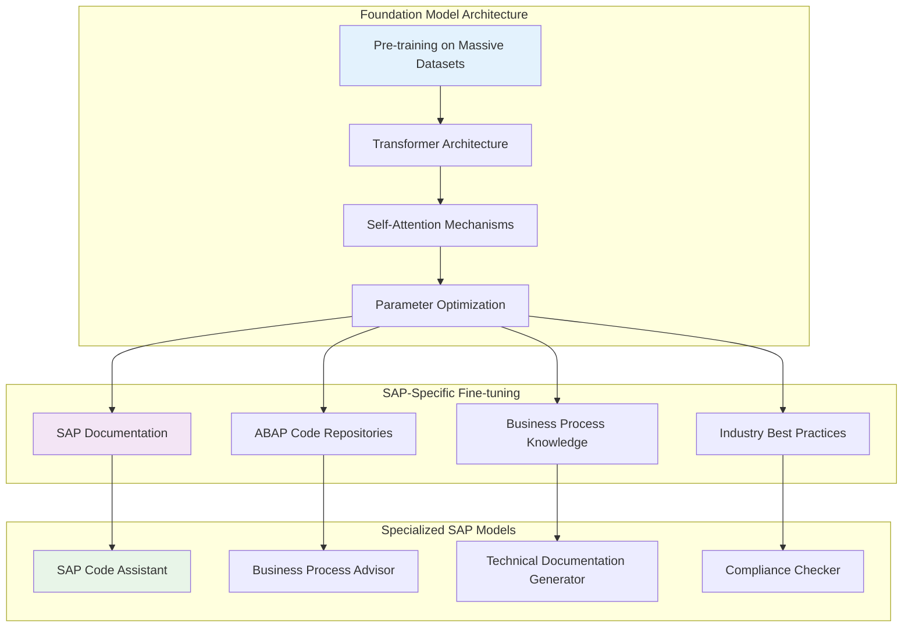

# MODULE 1: COMPLETE SAP GENERATIVE AI CURRICULUM
## Foundation for Generative AI

### Module Learning Objective
Establish a comprehensive understanding of Generative AI fundamentals and AWS AI services ecosystem, specifically tailored for SAP professionals to build intelligent, AI-powered SAP solutions.

### Lesson Objectives
By the end of this module, you will be able to:
- Understand the fundamentals of Generative AI and its applications in SAP environments
- Navigate the complete AWS AI services ecosystem for SAP integration
- Identify appropriate AI services for different SAP use cases
- Design AI-powered SAP solution architectures
- Understand the role of foundation models in enterprise SAP applications

---

## Module Introduction: The AI Revolution in SAP

### The Generative AI Paradigm Shift

The integration of Generative AI with SAP systems represents the most significant technological advancement since the introduction of cloud computing. This transformation enables:

- **Natural Language Interfaces** for complex SAP operations
- **Intelligent Automation** of routine business processes
- **Predictive Analytics** for proactive decision making
- **Conversational AI** for enhanced user experiences

---

## 1.1 Generative AI Fundamentals

### 1.1.1 What is Generative AI?

Generative AI refers to artificial intelligence systems that can create new content, code, insights, or solutions based on patterns learned from training data. Unlike traditional AI that classifies or predicts, Generative AI **creates** new outputs.

#### Key Characteristics of Generative AI:

**1. Content Creation**
- Generate human-like text, code, and documentation
- Create visual content and data visualizations
- Produce structured data and reports

**2. Contextual Understanding**
- Comprehend business context and domain-specific knowledge
- Maintain conversation history and context
- Adapt responses based on user roles and permissions

**3. Multimodal Capabilities**
- Process text, images, audio, and structured data
- Generate outputs in multiple formats
- Cross-modal understanding and generation

### 1.1.2 Foundation Models and Large Language Models (LLMs)

#### Popular Foundation Models for SAP:

**Text Generation Models:**
- **Claude (Anthropic)**: Excellent for complex reasoning and code generation
- **GPT-4 (OpenAI)**: Strong general-purpose capabilities
- **Llama 2 (Meta)**: Open-source alternative with good performance

**Code-Specific Models:**
- **CodeWhisperer**: AWS's code generation service
- **GitHub Copilot**: Microsoft's AI pair programmer
- **Tabnine**: AI code completion tool

---

## 1.2 AWS AI Services Ecosystem for SAP

### 1.2.1 Complete AWS AI Services Architecture

### 1.2.2 Amazon Bedrock: The Foundation Model Hub

Amazon Bedrock is AWS's fully managed service that provides access to foundation models from leading AI companies through a single API.

#### Key Features for SAP Integration:

**Model Variety**
- Access to multiple foundation models (Claude, Llama, Titan, etc.)
- Choose the best model for specific SAP use cases
- Easy model switching and comparison

**Enterprise Security**
- Data privacy and security controls
- VPC integration for secure SAP connectivity
- Compliance with enterprise governance requirements

**Customization Capabilities**
- Fine-tuning with SAP-specific data
- Custom model training for specialized use cases
- Knowledge base integration

### 1.2.3 Amazon Q Developer: AI-Powered Development

Amazon Q Developer transforms how SAP developers write, understand, and optimize code.

#### Core Capabilities:

#### SAP-Specific Features:

**ABAP Intelligence**
- Understands SAP development patterns
- Generates SAP-compliant code
- Suggests framework-appropriate solutions

**BTP Development**
- CAP model development assistance
- Fiori application generation
- Integration service creation

### 1.2.4 Amazon Q Business: Enterprise Knowledge Assistant

Amazon Q Business provides conversational AI capabilities for enterprise knowledge management and business process automation.

#### SAP Business Applications:

### 1.2.5 Amazon Bedrock Agent Core: Intelligent Agent Framework

Amazon Bedrock Agent Core provides enterprise-grade infrastructure for building and deploying AI agents that can interact with SAP systems.

#### Agent Core Architecture:

### 1.2.6 MCP (Model Context Protocol) Servers

MCP servers enable AI systems to interact with external tools and data sources, creating a bridge between AI models and SAP systems.

#### MCP Server Architecture for SAP:

#### Benefits of MCP Servers:

**Real-time SAP Integration**
- Direct API connectivity to SAP systems
- Live data access and manipulation
- Seamless user experience

**Extensibility**
- Custom tool development
- Third-party service integration
- Flexible architecture

---

## 1.3 Generative AI Use Cases in SAP

### 1.3.1 Development and Technical Use Cases

### 1.3.2 Business Process Use Cases

---

## 1.4 AI Service Selection Framework

### 1.4.1 Decision Matrix for SAP AI Implementation

### 1.4.2 Service Comparison Matrix

| Use Case | Amazon Q Developer | Amazon Q Business | Amazon Bedrock | MCP Servers | Agent Core |
|----------|-------------------|-------------------|----------------|-------------|------------|
| **ABAP Development** | ✅ Primary | ❌ No | ⚠️ Custom | ⚠️ Integration | ❌ No |
| **Business Q&A** | ❌ No | ✅ Primary | ⚠️ Custom | ❌ No | ⚠️ Agents |
| **Document Processing** | ❌ No | ⚠️ Limited | ✅ Primary | ❌ No | ✅ Tools |
| **System Integration** | ❌ No | ❌ No | ⚠️ Custom | ✅ Primary | ✅ Runtime |
| **Custom AI Apps** | ❌ No | ❌ No | ✅ Primary | ⚠️ Tools | ✅ Framework |

**Legend:**
- ✅ Primary: Best choice for this use case
- ⚠️ Custom/Limited: Requires customization or has limitations
- ❌ No: Not suitable for this use case

---

## 1.5 Getting Started with SAP AI

### 1.5.1 Implementation Roadmap

### 1.5.2 Prerequisites and Requirements

#### Technical Prerequisites:
- **AWS Account** with appropriate permissions
- **SAP System Access** (development/sandbox environment)
- **Basic Understanding** of SAP architecture and business processes
- **Development Environment** (VS Code, Eclipse ADT, or SAP BAS)

#### Organizational Prerequisites:
- **Executive Sponsorship** for AI initiatives
- **Change Management** process for new tools
- **Security and Compliance** review and approval
- **Training Budget** for team upskilling

---

## 1.6 Security and Governance Considerations

### 1.6.1 AI Security Framework for SAP

#### Key Security Considerations:

**Data Protection**
- Ensure SAP data remains within approved geographic boundaries
- Implement encryption for data in transit and at rest
- Control access to sensitive business information

**Model Governance**
- Validate AI model outputs for accuracy and appropriateness
- Monitor for potential bias in AI-generated content
- Maintain audit trails for AI-assisted decisions

**Integration Security**
- Secure API connections between SAP and AWS services
- Implement proper authentication and authorization
- Monitor AI service usage and access patterns

---

## Module Summary

### Key Takeaways

### Next Steps

1. **Evaluate Current SAP Environment** for AI readiness
2. **Identify Pilot Use Cases** with high impact and low complexity
3. **Set Up AWS AI Services** in a development environment
4. **Begin with Amazon Q Developer** for immediate productivity gains
5. **Plan Broader AI Integration** across SAP landscape

### Learning Path Continuation

- **Module 2**: SAP Analytics with Generative AI
- **Module 3**: SAP Development with Generative AI  
- **Module 4**: Advanced AI Integration Patterns
- **Module 5**: Enterprise AI Governance and Scaling

---

*This foundation module prepares you for the exciting journey of transforming SAP operations with Generative AI. The combination of AWS's powerful AI services and SAP's robust enterprise platform creates unprecedented opportunities for innovation and efficiency.*
