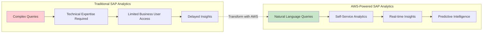
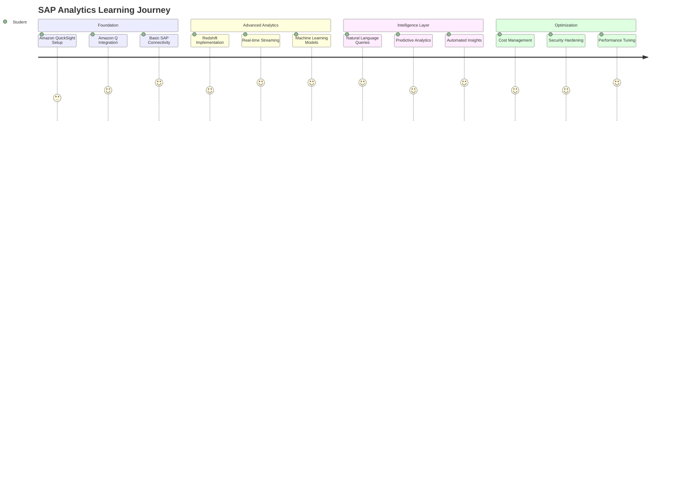
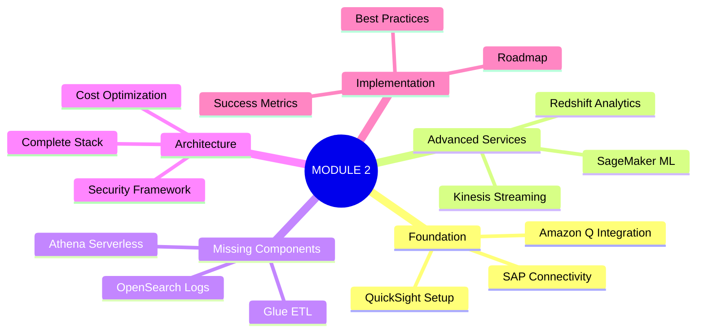

# MODULE 2: SAP ANALYTICS WITH AWS AI/ML SERVICES
## Lesson Introduction

### Welcome to the Future of SAP Analytics

In today's rapidly evolving digital landscape, organizations running SAP systems face an unprecedented challenge: **how to unlock the true value of their enterprise data while maintaining operational excellence**. Traditional SAP analytics approaches, while functional, often create barriers between business users and the insights they desperately need to drive strategic decisions.

This module represents a paradigm shift in how we approach SAP analytics—moving from rigid, technical implementations to intelligent, conversational, and predictive analytics ecosystems powered by AWS's comprehensive AI and machine learning services.

---

## The SAP Analytics Evolution

### From Traditional to Transformational

**The Traditional Challenge:**
- SAP analytics required deep technical knowledge of transaction codes, table structures, and complex query languages
- Business users depended on IT teams for basic reporting needs
- Insights were often historical rather than predictive
- Real-time decision making was limited by batch processing constraints

**The AWS-Powered Solution:**
- Natural language interfaces that understand business context
- Self-service analytics that empower business users
- Real-time streaming analytics for immediate insights
- Machine learning models that predict future trends and outcomes

---

## Why This Module Matters Now

### The Business Imperative

Organizations today are experiencing three critical pressures that make advanced SAP analytics not just beneficial, but essential:

#### 1. **Digital Transformation Acceleration** 🚀
- **SAP S/4HANA migrations** are creating opportunities to modernize analytics approaches
- **Cloud-first strategies** demand scalable, flexible analytics solutions
- **Remote work environments** require accessible, self-service analytics tools

#### 2. **Data Volume Explosion** 📊
- SAP systems now generate **10x more data** than they did five years ago
- **IoT integration** with SAP is creating new data streams
- **Real-time processing** requirements are becoming standard, not exceptional

#### 3. **Competitive Intelligence Demands** 🎯
- **Millisecond decision-making** in supply chain and financial operations
- **Predictive insights** for customer behavior and market trends
- **Automated anomaly detection** for fraud prevention and risk management

---

## What You'll Master in This Module

### Core Learning Outcomes

By the end of this comprehensive module, you will have the knowledge and practical skills to:

#### **Foundation Level** 🏗️
- **Design and implement** end-to-end SAP analytics architectures on AWS
- **Configure Amazon QuickSight** with Amazon Q for natural language SAP queries
- **Set up real-time data pipelines** from SAP systems to AWS analytics services

#### **Advanced Level** 🔬
- **Build predictive models** using SAP data with Amazon SageMaker
- **Implement real-time streaming analytics** with Amazon Kinesis for SAP business processes
- **Create intelligent data lakes** with automated SAP data governance

#### **Expert Level** 🎓
- **Optimize costs** across the entire SAP analytics ecosystem
- **Implement enterprise-grade security** for sensitive SAP data
- **Design self-healing, auto-scaling** analytics infrastructures

---

## Real-World Impact: Success Stories

### Case Study Preview: Global Manufacturing Company

**Challenge:** A Fortune 500 manufacturing company with 50+ SAP instances across 30 countries struggled with:
- 72-hour delay in critical supply chain insights
- $2M monthly cost for traditional SAP analytics infrastructure
- Limited access to analytics for 80% of business users

**AWS Solution Implemented:**
- Amazon Q in QuickSight for natural language queries
- Real-time Kinesis streaming for supply chain monitoring
- SageMaker ML models for demand forecasting

**Results Achieved:**
- **Reduced insight delivery time from 72 hours to 5 minutes**
- **Cut analytics infrastructure costs by 60%**
- **Increased business user analytics adoption by 400%**

---

## The Learning Journey Ahead

### Module Structure and Flow

### Hands-On Learning Approach

This module is designed around **practical implementation** rather than theoretical concepts:

#### **Interactive Labs** 🧪
- **Live SAP system connections** to real AWS services
- **Step-by-step guided implementations** with actual business scenarios
- **Troubleshooting exercises** based on common real-world challenges

#### **Business Scenario Simulations** 💼
- **Order-to-Cash analytics** for a retail company during peak season
- **Procure-to-Pay optimization** for a global supply chain
- **Financial close automation** for a multinational corporation

#### **Capstone Project** 🏆
- **End-to-end implementation** of a complete SAP analytics solution
- **Real business problem solving** with measurable outcomes
- **Presentation to stakeholders** with ROI justification

---

## Prerequisites and Expectations

### What You Should Know

#### **Technical Prerequisites** 💻
- Basic understanding of SAP business processes (O2C, P2P, R2R)
- Familiarity with AWS core services (S3, EC2, IAM)
- SQL query writing experience
- Basic understanding of data warehousing concepts

#### **Business Prerequisites** 📈
- Understanding of enterprise analytics requirements
- Familiarity with business intelligence concepts
- Experience with data-driven decision making

### What We'll Provide

#### **Complete Learning Environment** 🌐
- **Pre-configured SAP sandbox** with sample business data
- **AWS account access** with all necessary services enabled
- **Step-by-step implementation guides** with screenshots and code samples

#### **Expert Support** 👨‍🏫
- **Live Q&A sessions** with AWS SAP specialists
- **Community forum access** for peer learning and problem solving
- **Office hours** for personalized guidance on complex implementations

---

## The Transformation Awaits

### Your Analytics Journey Starts Here

As we embark on this comprehensive exploration of SAP analytics with AWS AI/ML services, remember that you're not just learning new technologies—you're **mastering the future of enterprise analytics**.

The skills you'll develop in this module will enable you to:
- **Transform how your organization makes decisions** with real-time, intelligent insights
- **Democratize analytics access** across your entire business user community  
- **Reduce costs while increasing capabilities** through cloud-native architectures
- **Future-proof your SAP investments** with scalable, AI-powered analytics

### Ready to Begin?

The next section will dive deep into Amazon QuickSight and Amazon Q integration with SAP systems. You'll start by connecting to live SAP data and creating your first natural language query that would have taken hours to implement using traditional methods.

**Let's transform your SAP analytics capabilities together!** 🚀

---

## Quick Reference: Module Navigation

**Navigation Tips:**
- Each section builds upon the previous one
- Hands-on labs are integrated throughout
- Reference materials are available for quick lookup
- Progress checkpoints help track your learning journey

**Let's begin this exciting transformation of your SAP analytics capabilities!** ✨
