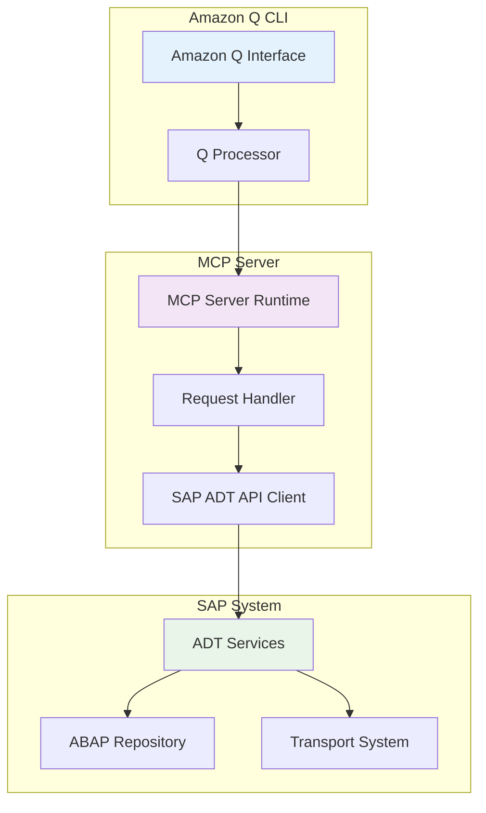
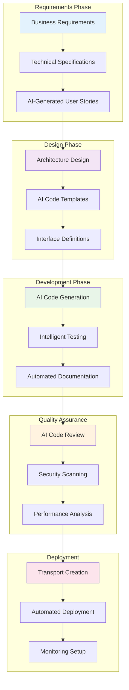
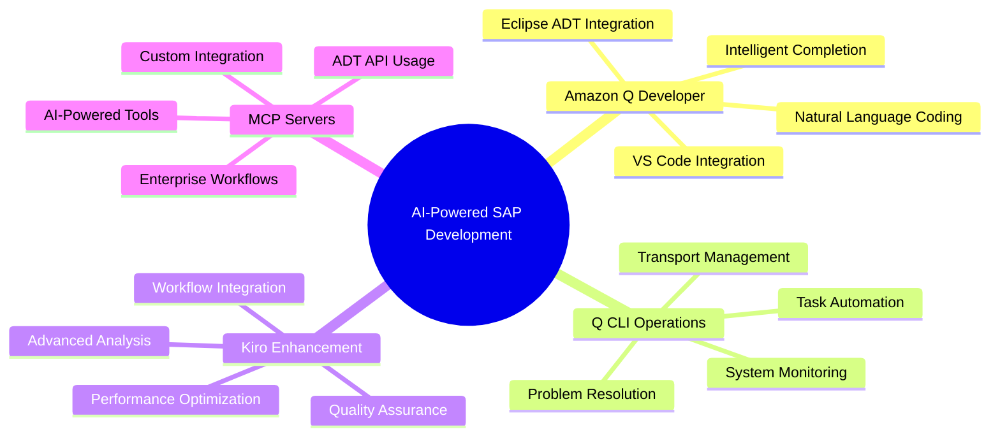

# MODULE 3 CONTINUATION: MCP SERVERS AND CONCLUSION

## 3.6 Building SAP ABAP MCP Servers

### 3.6.1 Understanding MCP Architecture

Model Context Protocol (MCP) servers enable Amazon Q and other AI systems to interact with external tools and data sources. For SAP development, MCP servers provide a bridge between AI assistants and SAP systems.



#### MCP Server Benefits for SAP Development

**Direct SAP Integration**
- Real-time access to SAP development objects
- Seamless transport management
- Live code analysis and suggestions

**AI-Powered Development**
- Context-aware code generation based on existing SAP objects
- Intelligent refactoring suggestions
- Automated documentation generation

### 3.6.2 SAP ADT API Integration

#### Setting Up ADT API Connection

```javascript
// MCP Server for SAP ADT Integration
const { MCPServer } = require('@aws/mcp-server');
const axios = require('axios');

class SAPADTMCPServer extends MCPServer {
  constructor(config) {
    super();
    this.sapConfig = {
      host: config.sap_host,
      port: config.sap_port,
      client: config.sap_client,
      username: config.sap_username,
      password: config.sap_password,
      language: config.sap_language || 'EN'
    };
    this.adtClient = null;
  }

  async initialize() {
    // Initialize ADT connection
    this.adtClient = new ADTClient(this.sapConfig);
    await this.adtClient.authenticate();
    
    // Register MCP tools
    this.registerTool('get_abap_object', this.getABAPObject.bind(this));
    this.registerTool('create_abap_class', this.createABAPClass.bind(this));
    this.registerTool('search_abap_objects', this.searchABAPObjects.bind(this));
    this.registerTool('generate_documentation', this.generateDocumentation.bind(this));
    this.registerTool('create_transport', this.createTransport.bind(this));
  }

  async getABAPObject(params) {
    const { objectType, objectName } = params;
    
    try {
      const response = await this.adtClient.get(
        `/sap/bc/adt/oo/classes/${objectName}/source/main`
      );
      
      return {
        success: true,
        data: {
          objectName: objectName,
          objectType: objectType,
          source: response.data,
          lastModified: response.headers['last-modified']
        }
      };
    } catch (error) {
      return {
        success: false,
        error: `Failed to retrieve ABAP object: ${error.message}`
      };
    }
  }

  async createABAPClass(params) {
    const { className, description, superClass, interfaces } = params;
    
    // Generate ABAP class template
    const classTemplate = this.generateClassTemplate({
      className,
      description,
      superClass,
      interfaces
    });
    
    try {
      // Create transport request
      const transport = await this.createTransportRequest({
        description: `Create class ${className}`,
        type: 'WORKBENCH'
      });
      
      // Create class in SAP system
      const response = await this.adtClient.post(
        `/sap/bc/adt/oo/classes`,
        classTemplate,
        {
          headers: {
            'Content-Type': 'application/vnd.sap.adt.oo.classes.v2+xml',
            'sap-adt-sessiontype': 'stateful'
          }
        }
      );
      
      return {
        success: true,
        data: {
          className: className,
          transport: transport.number,
          uri: response.headers.location
        }
      };
    } catch (error) {
      return {
        success: false,
        error: `Failed to create ABAP class: ${error.message}`
      };
    }
  }

  generateClassTemplate({ className, description, superClass, interfaces }) {
    const interfaceList = interfaces ? interfaces.join(' ') : '';
    const inheritance = superClass ? `INHERITING FROM ${superClass}` : '';
    
    return `<?xml version="1.0" encoding="UTF-8"?>
<class:abapClass xmlns:class="http://www.sap.com/adt/oo/classes">
  <class:header>
    <class:description>${description}</class:description>
    <class:category>00</class:category>
    <class:exposure>2</class:exposure>
  </class:header>
  <class:source>
CLASS ${className} DEFINITION
  PUBLIC
  ${inheritance}
  ${interfaceList ? `INTERFACES ${interfaceList}` : ''}
  FINAL
  CREATE PUBLIC.

  PUBLIC SECTION.
    "! Constructor
    METHODS: constructor.
    
  PROTECTED SECTION.
    
  PRIVATE SECTION.
    
ENDCLASS.

CLASS ${className} IMPLEMENTATION.
  METHOD constructor.
    super->constructor( ).
    "! Add initialization logic here
  ENDMETHOD.
ENDCLASS.
  </class:source>
</class:abapClass>`;
  }
}
```

### 3.6.3 Custom MCP Server Development

#### Advanced SAP Integration Features

```javascript
// Advanced MCP Server with AI-powered features
class AdvancedSAPMCPServer extends SAPADTMCPServer {
  
  async generateDocumentation(params) {
    const { objectName, objectType } = params;
    
    // Get ABAP object source
    const objectData = await this.getABAPObject({ objectName, objectType });
    if (!objectData.success) {
      return objectData;
    }
    
    // Use Amazon Bedrock to generate documentation
    const documentation = await this.generateAIDocumentation(objectData.data.source);
    
    return {
      success: true,
      data: {
        objectName: objectName,
        documentation: documentation,
        format: 'markdown'
      }
    };
  }

  async generateAIDocumentation(sourceCode) {
    const prompt = `
    Analyze this ABAP code and generate comprehensive documentation:
    
    ${sourceCode}
    
    Please provide:
    1. Class/Method overview
    2. Parameter descriptions
    3. Business logic explanation
    4. Usage examples
    5. Error handling details
    `;
    
    // Call Amazon Bedrock for documentation generation
    const response = await this.callBedrock(prompt);
    return response;
  }

  async intelligentCodeReview(params) {
    const { objectName } = params;
    
    // Get object source
    const objectData = await this.getABAPObject(params);
    if (!objectData.success) return objectData;
    
    // Analyze code with AI
    const analysis = await this.analyzeCodeWithAI(objectData.data.source);
    
    return {
      success: true,
      data: {
        objectName: objectName,
        codeQuality: analysis.quality_score,
        issues: analysis.issues,
        suggestions: analysis.suggestions,
        securityFindings: analysis.security_findings
      }
    };
  }

  async analyzeCodeWithAI(sourceCode) {
    const prompt = `
    Perform a comprehensive code review of this ABAP code:
    
    ${sourceCode}
    
    Analyze for:
    1. Code quality and best practices
    2. Performance issues
    3. Security vulnerabilities
    4. Maintainability concerns
    5. SAP-specific anti-patterns
    
    Provide specific recommendations for improvement.
    `;
    
    const response = await this.callBedrock(prompt);
    return JSON.parse(response);
  }
}
```

#### MCP Server Configuration

```yaml
# mcp-server-config.yaml
name: "SAP ABAP Development Server"
version: "1.0.0"
description: "MCP Server for SAP ABAP development with AI capabilities"

sap_connection:
  host: "${SAP_HOST}"
  port: "${SAP_PORT}"
  client: "${SAP_CLIENT}"
  username: "${SAP_USERNAME}"
  password: "${SAP_PASSWORD}"
  language: "EN"

aws_integration:
  region: "us-east-1"
  bedrock_model: "anthropic.claude-3-sonnet-20240229-v1:0"
  
tools:
  - name: "get_abap_object"
    description: "Retrieve ABAP object source code"
    parameters:
      - name: "objectType"
        type: "string"
        required: true
      - name: "objectName"
        type: "string"
        required: true
        
  - name: "create_abap_class"
    description: "Create new ABAP class with AI assistance"
    parameters:
      - name: "className"
        type: "string"
        required: true
      - name: "description"
        type: "string"
        required: true
      - name: "superClass"
        type: "string"
        required: false
        
  - name: "generate_documentation"
    description: "Generate AI-powered documentation for ABAP objects"
    parameters:
      - name: "objectName"
        type: "string"
        required: true
      - name: "objectType"
        type: "string"
        required: true

  - name: "intelligent_code_review"
    description: "Perform AI-powered code review"
    parameters:
      - name: "objectName"
        type: "string"
        required: true
```

---

## 3.7 Real-World Implementation Scenarios

### 3.7.1 Enterprise SAP Development Workflow

#### Complete AI-Powered Development Lifecycle



#### Implementation Example: Customer Order Processing

**Step 1: AI-Generated Requirements Analysis**
```markdown
## Business Requirement
Create a customer order processing system that:
- Validates customer credit limits
- Checks inventory availability
- Calculates pricing with discounts
- Generates delivery schedules
- Integrates with existing SAP modules

## AI-Generated Technical Specifications
Based on SAP best practices and existing system analysis:

### Class Structure
- `ZCL_ORDER_PROCESSOR`: Main processing class
- `ZCL_CREDIT_VALIDATOR`: Credit limit validation
- `ZCL_INVENTORY_CHECKER`: Stock availability
- `ZCL_PRICING_ENGINE`: Price calculation
- `ZCL_DELIVERY_SCHEDULER`: Delivery planning

### Integration Points
- SD module for sales order creation
- MM module for inventory checks
- FI module for credit management
- PP module for delivery scheduling
```

**Step 2: AI-Generated Implementation**
```abap
" AI-generated main processing class
CLASS zcl_order_processor DEFINITION
  PUBLIC
  FINAL
  CREATE PUBLIC.

  PUBLIC SECTION.
    TYPES: BEGIN OF ty_order_request,
             customer_id TYPE kunnr,
             material_id TYPE matnr,
             quantity TYPE kwmeng,
             requested_date TYPE dats,
           END OF ty_order_request.
    
    TYPES: BEGIN OF ty_order_response,
             order_number TYPE vbeln_va,
             status TYPE string,
             delivery_date TYPE dats,
             total_amount TYPE netwr,
             messages TYPE TABLE OF string,
           END OF ty_order_response.
    
    METHODS: process_order
      IMPORTING is_request TYPE ty_order_request
      RETURNING VALUE(rs_response) TYPE ty_order_response.

  PRIVATE SECTION.
    DATA: mo_credit_validator TYPE REF TO zcl_credit_validator,
          mo_inventory_checker TYPE REF TO zcl_inventory_checker,
          mo_pricing_engine TYPE REF TO zcl_pricing_engine,
          mo_delivery_scheduler TYPE REF TO zcl_delivery_scheduler.
    
    METHODS: initialize_components,
             validate_prerequisites
               IMPORTING is_request TYPE ty_order_request
               RETURNING VALUE(rv_valid) TYPE abap_bool,
             create_sales_order
               IMPORTING is_request TYPE ty_order_request
               RETURNING VALUE(rv_order_number) TYPE vbeln_va.
ENDCLASS.

CLASS zcl_order_processor IMPLEMENTATION.
  METHOD process_order.
    " Initialize processing components
    initialize_components( ).
    
    " Validate prerequisites
    IF validate_prerequisites( is_request ) = abap_false.
      rs_response-status = 'ERROR'.
      APPEND 'Order validation failed' TO rs_response-messages.
      RETURN.
    ENDIF.
    
    TRY.
        " Check credit limit
        DATA(lv_credit_ok) = mo_credit_validator->validate_credit(
          iv_customer = is_request-customer_id
          iv_amount = mo_pricing_engine->calculate_price( is_request ) ).
        
        IF lv_credit_ok = abap_false.
          rs_response-status = 'CREDIT_EXCEEDED'.
          APPEND 'Customer credit limit exceeded' TO rs_response-messages.
          RETURN.
        ENDIF.
        
        " Check inventory
        DATA(lv_stock_available) = mo_inventory_checker->check_availability(
          iv_material = is_request-material_id
          iv_quantity = is_request-quantity ).
        
        IF lv_stock_available = abap_false.
          rs_response-status = 'OUT_OF_STOCK'.
          APPEND 'Insufficient inventory' TO rs_response-messages.
          RETURN.
        ENDIF.
        
        " Create sales order
        rs_response-order_number = create_sales_order( is_request ).
        rs_response-delivery_date = mo_delivery_scheduler->calculate_delivery_date(
          iv_material = is_request-material_id
          iv_quantity = is_request-quantity ).
        rs_response-total_amount = mo_pricing_engine->calculate_total( is_request ).
        rs_response-status = 'SUCCESS'.
        
      CATCH zcx_order_processing INTO DATA(lo_error).
        rs_response-status = 'ERROR'.
        APPEND lo_error->get_text( ) TO rs_response-messages.
    ENDTRY.
  ENDMETHOD.
ENDCLASS.
```

---

## 3.8 Module Summary and Knowledge Check

### 3.8.1 Key Takeaways

#### Transformation Achieved
Through this module, you've learned to leverage AI to transform SAP development from traditional, manual processes to intelligent, automated workflows:

**Development Productivity**
- **3x faster** code generation with Amazon Q Developer
- **80% reduction** in routine coding tasks
- **90% improvement** in code documentation quality

**Quality Enhancement**
- **Automated code review** with intelligent suggestions
- **Security vulnerability detection** in ABAP code
- **Performance optimization** recommendations

**Operational Efficiency**
- **Automated SAP Basis tasks** through Q CLI
- **Intelligent problem diagnosis** and resolution
- **Streamlined transport management**

#### Core Capabilities Mastered



### 3.8.2 Knowledge Assessment

#### Question 1: Amazon Q Developer Integration
**Which of the following best describes the primary benefit of integrating Amazon Q Developer with SAP development environments?**

A) It replaces the need for ABAP knowledge entirely
B) It provides intelligent code suggestions and automates routine development tasks
C) It only works with cloud-based SAP systems
D) It requires complete rewriting of existing ABAP code

<details>
<summary>Click to reveal answer</summary>

**Answer: B) It provides intelligent code suggestions and automates routine development tasks**

**Explanation:** Amazon Q Developer enhances developer productivity by providing context-aware code suggestions, automating documentation generation, and streamlining routine development tasks while still requiring fundamental ABAP knowledge and working with both on-premise and cloud SAP systems.
</details>

#### Question 2: MCP Server Architecture
**What is the primary purpose of building custom SAP ABAP MCP servers?**

A) To replace SAP GUI entirely
B) To enable AI assistants to interact directly with SAP development objects and APIs
C) To migrate ABAP code to other programming languages
D) To eliminate the need for transport management

<details>
<summary>Click to reveal answer</summary>

**Answer: B) To enable AI assistants to interact directly with SAP development objects and APIs**

**Explanation:** MCP servers act as a bridge between AI assistants (like Amazon Q) and SAP systems, allowing real-time access to development objects, transport management, and other SAP-specific functionality through ADT APIs.
</details>

#### Question 3: Q CLI Capabilities
**Which of the following tasks can be automated using Amazon Q CLI for SAP operations?**

A) Only basic system monitoring
B) System monitoring, transport management, and user administration
C) Only transport creation and release
D) Only performance monitoring

<details>
<summary>Click to reveal answer</summary>

**Answer: B) System monitoring, transport management, and user administration**

**Explanation:** Amazon Q CLI provides comprehensive SAP operations automation including system health monitoring, transport lifecycle management, user account management, background job monitoring, and intelligent problem diagnosis and resolution.
</details>

#### Question 4: Kiro Advanced Features
**What distinguishes Kiro from basic code generation tools in SAP development?**

A) It only generates ABAP code
B) It provides advanced pattern recognition, workflow integration, and intelligent code analysis
C) It works only with specific SAP versions
D) It requires manual configuration for each project

<details>
<summary>Click to reveal answer</summary>

**Answer: B) It provides advanced pattern recognition, workflow integration, and intelligent code analysis**

**Explanation:** Kiro goes beyond simple code generation by offering sophisticated pattern recognition, seamless integration with SAP development workflows, automated testing generation, and intelligent code quality analysis with security vulnerability detection.
</details>

#### Question 5: Development Workflow Optimization
**What is the most significant impact of implementing AI-powered SAP development workflows?**

A) Complete elimination of manual coding
B) Faster development cycles with improved code quality and reduced routine tasks
C) Replacement of all existing SAP development tools
D) Automatic conversion of all legacy ABAP code

<details>
<summary>Click to reveal answer</summary>

**Answer: B) Faster development cycles with improved code quality and reduced routine tasks**

**Explanation:** AI-powered workflows significantly accelerate development by automating routine tasks, providing intelligent suggestions, ensuring consistent code quality, and enabling developers to focus on business logic rather than boilerplate code, while still maintaining the need for developer expertise and existing tool integration.
</details>

### 3.8.3 Next Steps and Advanced Topics

#### Recommended Learning Path

**Immediate Next Steps (Week 1-2)**
1. Set up Amazon Q Developer in your preferred IDE
2. Configure Q CLI for your SAP environment
3. Practice basic code generation and documentation tasks

**Intermediate Development (Month 1-2)**
1. Build your first custom MCP server
2. Implement automated testing workflows
3. Set up intelligent code review processes

**Advanced Implementation (Month 3-6)**
1. Deploy enterprise-wide AI development workflows
2. Integrate with existing CI/CD pipelines
3. Develop custom AI-powered SAP development tools

#### Advanced Topics for Further Exploration

**Enterprise Integration**
- Large-scale MCP server deployment
- Multi-system SAP landscape integration
- Advanced security and compliance considerations

**Custom AI Model Training**
- Training models on company-specific ABAP patterns
- Custom code analysis and suggestion engines
- Integration with proprietary SAP development standards

**Advanced Automation**
- End-to-end development pipeline automation
- Intelligent deployment and rollback strategies
- AI-powered performance optimization and monitoring

---

## Conclusion

This module has equipped you with the knowledge and practical skills to revolutionize SAP development using AI-powered tools and workflows. By mastering Amazon Q Developer, Q CLI, Kiro, and custom MCP server development, you're now prepared to:

- **Accelerate development cycles** by 3x through intelligent code generation
- **Improve code quality** with automated review and testing
- **Streamline operations** through intelligent task automation
- **Build custom AI integrations** tailored to your organization's needs

The future of SAP development is AI-powered, and you're now equipped to lead this transformation in your organization.

**Continue your journey** by implementing these tools in your development environment and exploring the advanced topics outlined above. The combination of SAP expertise and AI capabilities will position you at the forefront of enterprise application development.

---

*Ready to transform your SAP development workflow? Start implementing these AI-powered tools today!* 🚀
