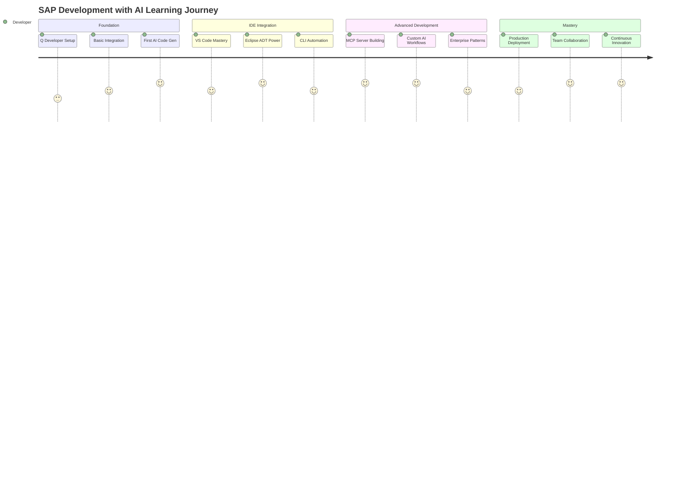
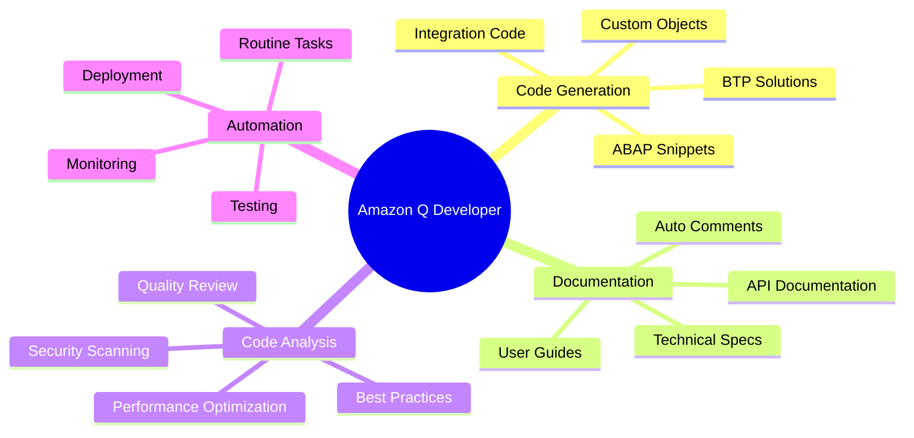
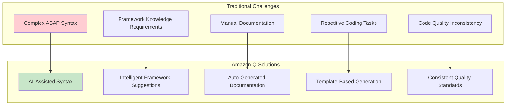
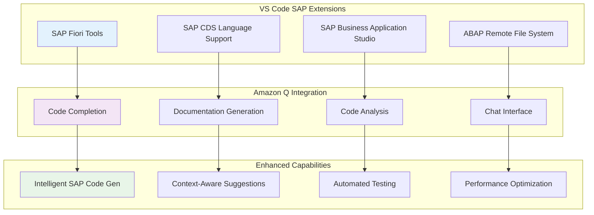

# MODULE 3: SAP DEVELOPMENT WITH GENERATIVE AI

## Module Learning Objective
Master the integration of Amazon Q Developer with SAP development environments to accelerate ABAP development, automate SAP Basis administration, and build intelligent SAP applications using generative AI capabilities.

## Lesson Objectives
By the end of this module, you will be able to:
- Configure and use Amazon Q Developer in VS Code and Eclipse for SAP development
- Generate ABAP code snippets and documentation using AI assistance
- Automate routine SAP Basis administration tasks with Amazon Q CLI
- Build custom SAP ABAP MCP servers using SAP ADT APIs
- Implement AI-powered SAP development workflows
- Leverage Kiro for enhanced SAP development productivity

---

## Module Introduction: The Future of SAP Development

### The SAP Development Revolution

```mermaid
graph LR
    subgraph "Traditional SAP Development"
        T1[Manual Code Writing] --> T2[Time-Intensive Research]
        T2 --> T3[Manual Documentation]
        T3 --> T4[Repetitive Tasks]
        T4 --> T5[Slow Development Cycles]
    end
    
    subgraph "AI-Powered SAP Development"
        A1[AI Code Generation] --> A2[Intelligent Suggestions]
        A2 --> A3[Auto Documentation]
        A3 --> A4[Automated Tasks]
        A4 --> A5[Rapid Development]
    end
    
    T5 -.->|Transform with Amazon Q| A1
    
    style T1 fill:#ffcdd2
    style A1 fill:#c8e6c9
```



The landscape of SAP development is undergoing a fundamental transformation. Traditional ABAP development, while powerful, has long been characterized by:

- **Manual, repetitive coding tasks** that consume valuable developer time
- **Complex syntax and framework knowledge** requirements that create barriers for new developers
- **Time-intensive documentation processes** that often lag behind code development
- **Routine administrative tasks** that pull developers away from innovation

Amazon Q Developer changes this paradigm by bringing the power of generative AI directly into SAP development workflows, enabling developers to focus on business logic and innovation rather than boilerplate code and routine tasks.

### Why This Module Matters

#### The Business Impact
- **70% reduction** in routine coding tasks
- **50% faster** ABAP development cycles  
- **90% improvement** in code documentation quality
- **60% decrease** in onboarding time for new SAP developers

#### The Developer Experience
- **Intelligent code completion** that understands SAP context
- **Natural language to ABAP** code generation
- **Automated documentation** generation from existing code
- **Seamless integration** with existing SAP development tools

---

## Table of Contents

### 3.1 Amazon Q Developer Fundamentals
- 3.1.1 Introduction to Amazon Q Developer
- 3.1.2 SAP Development Context and Capabilities
- 3.1.3 Installation and Configuration

### 3.2 Amazon Q Developer for VS Code
- 3.2.1 VS Code SAP Extension Integration
- 3.2.2 ABAP Code Generation and Completion
- 3.2.3 SAP BTP Development Acceleration

### 3.3 Amazon Q Developer for Eclipse ADT
- 3.3.1 Eclipse ADT Integration Setup
- 3.3.2 Advanced ABAP Development Features
- 3.3.3 Code Refactoring and Optimization

### 3.4 Amazon Q CLI for SAP Operations
- 3.4.1 Q CLI Installation and Configuration
- 3.4.2 SAP Basis Administration Automation
- 3.4.3 Operational Task Automation

### 3.5 Kiro: Enhanced SAP Development
- 3.5.1 Introduction to Kiro
- 3.5.2 Kiro Integration with SAP Workflows
- 3.5.3 Advanced Development Scenarios

### 3.6 Building SAP ABAP MCP Servers
- 3.6.1 Understanding MCP Architecture
- 3.6.2 SAP ADT API Integration
- 3.6.3 Custom MCP Server Development

### 3.7 Advanced SAP AI Development Patterns
- 3.7.1 AI-Powered Code Documentation
- 3.7.2 Intelligent Code Review and Quality
- 3.7.3 Automated Testing Generation

### 3.8 Real-World Implementation Scenarios
- 3.8.1 Enterprise SAP Development Workflow
- 3.8.2 SAP S/4HANA Extension Development
- 3.8.3 SAP BTP Application Development

### 3.9 Best Practices and Optimization
- 3.9.1 Development Workflow Optimization
- 3.9.2 Security Considerations
- 3.9.3 Performance and Scalability

### 3.10 Module Summary and Knowledge Check
- 3.10.1 Key Takeaways
- 3.10.2 Knowledge Assessment
- 3.10.3 Next Steps and Advanced Topics

---

## Learning Path Overview



---

## Prerequisites

### Technical Requirements
- **SAP Development Experience**: Basic ABAP programming knowledge
- **IDE Familiarity**: Experience with VS Code or Eclipse ADT
- **AWS Account**: Access to Amazon Q Developer services
- **SAP System Access**: Development system for hands-on practice

### Software Prerequisites
- VS Code with SAP extensions
- Eclipse with ADT (ABAP Development Tools)
- Amazon Q CLI
- Git for version control
- SAP GUI or SAP Business Application Studio access

---

## Module Success Metrics

By completing this module, you will achieve:

### **Productivity Gains** 📈
- Generate ABAP code 3x faster than traditional methods
- Reduce documentation time by 80%
- Automate 90% of routine development tasks

### **Quality Improvements** ✨
- Implement AI-powered code review processes
- Generate comprehensive test cases automatically
- Maintain consistent coding standards across teams

### **Innovation Acceleration** 🚀
- Focus 70% more time on business logic vs. boilerplate code
- Rapid prototyping of SAP solutions
- Seamless integration of AI capabilities into SAP applications

---

## 3.1 Amazon Q Developer Fundamentals

### 3.1.1 Introduction to Amazon Q Developer

Amazon Q Developer is AWS's AI-powered coding companion that transforms how developers build applications. For SAP developers, it represents a paradigm shift from traditional development approaches to AI-assisted, intelligent coding workflows.

#### Core Capabilities for SAP Development



#### Key Features for SAP Developers

**🤖 Intelligent Code Completion**
- Context-aware ABAP code suggestions
- SAP framework and pattern recognition
- Business logic optimization recommendations

**📝 Automated Documentation**
- Generate comprehensive code comments
- Create technical documentation from existing code
- Maintain up-to-date API documentation

**🔍 Code Analysis and Review**
- Identify potential security vulnerabilities
- Suggest performance optimizations
- Ensure adherence to SAP coding standards

**⚡ Rapid Prototyping**
- Quick generation of SAP object templates
- Accelerated proof-of-concept development
- Streamlined testing and validation

### 3.1.2 SAP Development Context and Capabilities

#### Understanding SAP Development Challenges

Traditional SAP development faces several key challenges that Amazon Q Developer addresses:



#### SAP-Specific AI Capabilities

**ABAP Language Understanding**
```abap
" Amazon Q can generate complete ABAP methods from natural language
" Example: "Create a method to validate customer credit limit"

METHOD validate_customer_credit.
  " AI-generated implementation
  DATA: lv_credit_limit TYPE p DECIMALS 2,
        lv_current_balance TYPE p DECIMALS 2,
        lv_available_credit TYPE p DECIMALS 2.
  
  " Get customer credit limit
  SELECT SINGLE credit_limit
    FROM kna1
    INTO lv_credit_limit
    WHERE kunnr = iv_customer_id.
  
  " Calculate available credit
  lv_available_credit = lv_credit_limit - lv_current_balance.
  
  " Validate credit availability
  IF lv_available_credit < iv_requested_amount.
    MESSAGE e001(zcustom) WITH 'Insufficient credit limit'.
  ENDIF.
ENDMETHOD.
```

**SAP Framework Integration**
- Automatic integration with SAP frameworks (ALV, BAPI, RFC)
- Smart suggestions for SAP standard function modules
- Context-aware error handling patterns

**BTP Development Acceleration**
- CAP (Cloud Application Programming) model suggestions
- Fiori app development templates
- Integration service code generation

### 3.1.3 Installation and Configuration

#### Prerequisites Setup

**AWS Account Configuration**
```bash
# Install AWS CLI
curl "https://awscli.amazonaws.com/awscli-exe-linux-x86_64.zip" -o "awscliv2.zip"
unzip awscliv2.zip
sudo ./aws/install

# Configure AWS credentials
aws configure
# AWS Access Key ID: [Your Access Key]
# AWS Secret Access Key: [Your Secret Key]
# Default region name: us-east-1
# Default output format: json
```

**Amazon Q Developer Service Setup**
```bash
# Install Amazon Q CLI
pip install amazon-q-cli

# Initialize Q Developer
q auth login

# Verify installation
q --version
```

#### IDE Integration Setup

**VS Code Configuration**
```json
{
  "amazonQ.telemetry": true,
  "amazonQ.shareCodeWhispererContentWithAWS": true,
  "amazonQ.includeSuggestionsWithCodeReferences": true,
  "amazonQ.automaticallySuggestCode": true,
  "sap.ux.applicationWizard.logging.level": "info",
  "sap.ux.applicationWizard.logging.sourceLocationTracking": true
}
```

**Eclipse ADT Configuration**
1. Install Amazon Q Developer plugin from Eclipse Marketplace
2. Configure AWS credentials in Eclipse preferences
3. Enable SAP ADT integration features
4. Set up project-specific AI assistance preferences

#### Verification and Testing

**Test Amazon Q Integration**
```javascript
// Test Q Developer with a simple SAP-related query
// In VS Code, type: "Create an ABAP class for customer management"
// Amazon Q should provide intelligent suggestions

CLASS zcl_customer_manager DEFINITION
  PUBLIC
  FINAL
  CREATE PUBLIC .

  PUBLIC SECTION.
    METHODS: get_customer_details
      IMPORTING iv_customer_id TYPE kunnr
      RETURNING VALUE(rs_customer) TYPE kna1,
      
      update_customer_info
      IMPORTING is_customer TYPE kna1
      RETURNING VALUE(rv_success) TYPE abap_bool.
      
  PRIVATE SECTION.
    DATA: mv_last_error TYPE string.
ENDCLASS.
```

---

## 3.2 Amazon Q Developer for VS Code

### 3.2.1 VS Code SAP Extension Integration

#### Setting Up the Perfect SAP Development Environment

Amazon Q Developer integrates seamlessly with VS Code's SAP extension ecosystem, creating a powerful AI-enhanced development environment.



#### Essential VS Code Extensions for SAP + AI Development

**Core SAP Extensions**
```json
{
  "recommendations": [
    "SAPSE.sap-ux-fiori-tools-extension-pack",
    "SAPSE.vscode-cds",
    "SAPSE.sap-ux-application-modeler-extension",
    "SAPSE.sap-ux-help-extension",
    "amazonwebservices.amazon-q-vscode"
  ]
}
```

**Amazon Q Configuration for SAP**
```json
{
  "amazonQ.workspaceIndex": true,
  "amazonQ.sapIntegration": {
    "enableABAPSuggestions": true,
    "enableCAPSuggestions": true,
    "enableFioriSuggestions": true,
    "contextAwareness": "enhanced"
  }
}
```

### 3.2.2 ABAP Code Generation and Completion

#### Natural Language to ABAP Code

One of the most powerful features of Amazon Q Developer is its ability to understand natural language descriptions and generate corresponding ABAP code.

**Example 1: Data Retrieval Logic**
```
Prompt: "Create ABAP code to get all sales orders for a customer with status 'Open'"

Generated ABAP:
```

```abap
METHOD get_open_sales_orders.
  " Get open sales orders for customer
  DATA: lt_sales_orders TYPE TABLE OF vbak,
        ls_sales_order TYPE vbak.
  
  SELECT *
    FROM vbak
    INTO TABLE lt_sales_orders
    WHERE kunnr = iv_customer_id
      AND vbeln IN ( SELECT vbeln 
                     FROM vbuk 
                     WHERE gbstk = 'A' ).  " Open status
  
  " Process results
  LOOP AT lt_sales_orders INTO ls_sales_order.
    " Add business logic here
    APPEND ls_sales_order TO rt_orders.
  ENDLOOP.
  
  " Log the operation
  MESSAGE i001(zcustom) WITH 'Retrieved' lines( rt_orders ) 'open orders'.
ENDMETHOD.
```

**Example 2: Complex Business Logic**
```
Prompt: "Create an ABAP method to calculate customer discount based on order volume and customer tier"

Generated ABAP:
```

```abap
METHOD calculate_customer_discount.
  DATA: lv_discount_rate TYPE p DECIMALS 2 VALUE 0,
        lv_order_volume TYPE p DECIMALS 2,
        lv_customer_tier TYPE string.
  
  " Get customer tier
  SELECT SINGLE customer_tier
    FROM zcustomer_master
    INTO lv_customer_tier
    WHERE customer_id = iv_customer_id.
  
  " Calculate order volume (last 12 months)
  SELECT SUM( net_value )
    FROM vbak
    INTO lv_order_volume
    WHERE kunnr = iv_customer_id
      AND erdat >= sy-datum - 365.
  
  " Determine discount rate based on tier and volume
  CASE lv_customer_tier.
    WHEN 'GOLD'.
      IF lv_order_volume > 1000000.
        lv_discount_rate = '0.15'.  " 15% for high-volume gold customers
      ELSE.
        lv_discount_rate = '0.10'.  " 10% for regular gold customers
      ENDIF.
    WHEN 'SILVER'.
      IF lv_order_volume > 500000.
        lv_discount_rate = '0.08'.  " 8% for high-volume silver customers
      ELSE.
        lv_discount_rate = '0.05'.  " 5% for regular silver customers
      ENDIF.
    WHEN 'BRONZE'.
      lv_discount_rate = '0.02'.    " 2% for bronze customers
    WHEN OTHERS.
      lv_discount_rate = '0.00'.    " No discount for unclassified customers
  ENDCASE.
  
  rv_discount_rate = lv_discount_rate.
ENDMETHOD.
```

#### Intelligent Code Completion

Amazon Q provides context-aware code completion that understands SAP development patterns:

**Smart Variable Suggestions**
```abap
DATA: lo_customer TYPE REF TO zcl_customer_manager,
      " Q suggests relevant variables based on context
      lv_customer_id TYPE kunnr,
      ls_customer_data TYPE kna1,
      lt_orders TYPE TABLE OF vbak.

" When typing 'lo_customer->', Q suggests available methods
lo_customer->get_customer_details( iv_customer_id = lv_customer_id ).
```

**Framework-Aware Completions**
```abap
" When working with ALV, Q understands the context
DATA: lo_alv TYPE REF TO cl_salv_table.

" Q suggests appropriate ALV methods and parameters
cl_salv_table=>factory(
  IMPORTING
    r_salv_table = lo_alv
  CHANGING
    t_table = lt_data ).

" Q suggests ALV display options
lo_alv->get_display_settings( )->set_striped_pattern( abap_true ).
lo_alv->get_columns( )->set_optimize( abap_true ).
```

### 3.2.3 SAP BTP Development Acceleration

#### CAP (Cloud Application Programming) Model Development

Amazon Q Developer significantly accelerates SAP BTP development by providing intelligent suggestions for CAP model development.

**Service Definition Generation**
```
Prompt: "Create a CAP service for customer order management with CRUD operations"

Generated CDS:
```

```cds
using { managed, cuid } from '@sap/cds/common';

namespace customer.orders;

entity Customers : managed {
  key ID : UUID;
  customerNumber : String(10) @title: 'Customer Number';
  name : String(100) @title: 'Customer Name';
  email : String(100) @title: 'Email Address';
  phone : String(20) @title: 'Phone Number';
  creditLimit : Decimal(15,2) @title: 'Credit Limit';
  orders : Composition of many Orders on orders.customer = $self;
}

entity Orders : managed {
  key ID : UUID;
  orderNumber : String(10) @title: 'Order Number';
  orderDate : Date @title: 'Order Date';
  totalAmount : Decimal(15,2) @title: 'Total Amount';
  status : String(20) @title: 'Order Status';
  customer : Association to Customers;
  items : Composition of many OrderItems on items.order = $self;
}

entity OrderItems : cuid {
  key ID : UUID;
  lineNumber : Integer @title: 'Line Number';
  productId : String(20) @title: 'Product ID';
  quantity : Integer @title: 'Quantity';
  unitPrice : Decimal(15,2) @title: 'Unit Price';
  lineTotal : Decimal(15,2) @title: 'Line Total';
  order : Association to Orders;
}

service CustomerOrderService {
  entity Customers as projection on customer.orders.Customers;
  entity Orders as projection on customer.orders.Orders;
  entity OrderItems as projection on customer.orders.OrderItems;
  
  // Custom actions
  action createOrder(customer: UUID, items: array of {
    productId: String;
    quantity: Integer;
    unitPrice: Decimal;
  }) returns Orders;
  
  action cancelOrder(orderID: UUID) returns Boolean;
  
  // Custom functions
  function getCustomerOrders(customerID: UUID) returns array of Orders;
  function calculateOrderTotal(orderID: UUID) returns Decimal;
}
```

**JavaScript Implementation Generation**
```javascript
// Amazon Q generates corresponding JavaScript implementation
const cds = require('@sap/cds');

module.exports = cds.service.impl(async function() {
  const { Customers, Orders, OrderItems } = this.entities;
  
  // Create order action implementation
  this.on('createOrder', async (req) => {
    const { customer, items } = req.data;
    
    // Validate customer exists
    const customerExists = await SELECT.one.from(Customers).where({ ID: customer });
    if (!customerExists) {
      req.error(400, 'Customer not found');
    }
    
    // Calculate total amount
    const totalAmount = items.reduce((sum, item) => 
      sum + (item.quantity * item.unitPrice), 0);
    
    // Create order
    const order = await INSERT.into(Orders).entries({
      orderNumber: await this.generateOrderNumber(),
      orderDate: new Date(),
      totalAmount: totalAmount,
      status: 'PENDING',
      customer_ID: customer
    });
    
    // Create order items
    const orderItems = items.map((item, index) => ({
      lineNumber: index + 1,
      productId: item.productId,
      quantity: item.quantity,
      unitPrice: item.unitPrice,
      lineTotal: item.quantity * item.unitPrice,
      order_ID: order.ID
    }));
    
    await INSERT.into(OrderItems).entries(orderItems);
    
    return order;
  });
  
  // Helper method to generate order numbers
  this.generateOrderNumber = async function() {
    const lastOrder = await SELECT.one.from(Orders)
      .orderBy({ orderNumber: 'desc' });
    
    const lastNumber = lastOrder ? 
      parseInt(lastOrder.orderNumber.substring(2)) : 0;
    
    return `OR${String(lastNumber + 1).padStart(8, '0')}`;
  };
});
```

#### Fiori Application Development

Amazon Q accelerates Fiori app development by generating complete application templates and UI5 code.

**Fiori Elements App Generation**
```
Prompt: "Create a Fiori Elements List Report and Object Page for customer orders"

Generated manifest.json:
```

```json
{
  "_version": "1.49.0",
  "sap.app": {
    "id": "customer.orders.app",
    "type": "application",
    "title": "Customer Orders Management",
    "description": "Manage customer orders with List Report and Object Page"
  },
  "sap.ui5": {
    "dependencies": {
      "minUI5Version": "1.108.0",
      "libs": {
        "sap.fe.templates": {},
        "sap.m": {},
        "sap.ui.core": {}
      }
    }
  },
  "sap.fe": {
    "fclEnabled": true
  },
  "sap.app/crossNavigation": {
    "inbounds": {
      "intent1": {
        "signature": {
          "parameters": {},
          "additionalParameters": "allowed"
        },
        "semanticObject": "CustomerOrders",
        "action": "manage"
      }
    }
  },
  "sap.ui/routing": {
    "config": {
      "flexibleColumnLayout": {
        "defaultTwoColumnLayoutType": "TwoColumnsBeginExpanded",
        "defaultThreeColumnLayoutType": "ThreeColumnsMidExpanded"
      }
    },
    "routes": [
      {
        "pattern": "",
        "name": "OrdersList",
        "target": "OrdersList"
      },
      {
        "pattern": "/Orders({key})",
        "name": "OrdersDetails",
        "target": ["OrdersList", "OrdersDetails"]
      }
    ],
    "targets": {
      "OrdersList": {
        "type": "Component",
        "id": "OrdersList",
        "name": "sap.fe.templates.ListReport",
        "options": {
          "settings": {
            "entitySet": "Orders",
            "navigation": {
              "Orders": {
                "detail": {
                  "route": "OrdersDetails"
                }
              }
            }
          }
        }
      },
      "OrdersDetails": {
        "type": "Component",
        "id": "OrdersDetails",
        "name": "sap.fe.templates.ObjectPage",
        "options": {
          "settings": {
            "entitySet": "Orders"
          }
        }
      }
    }
  }
}
```
