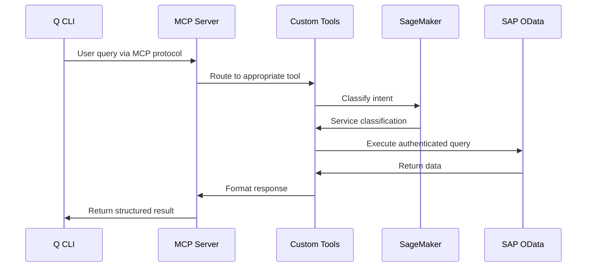
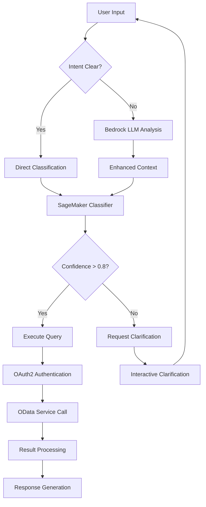
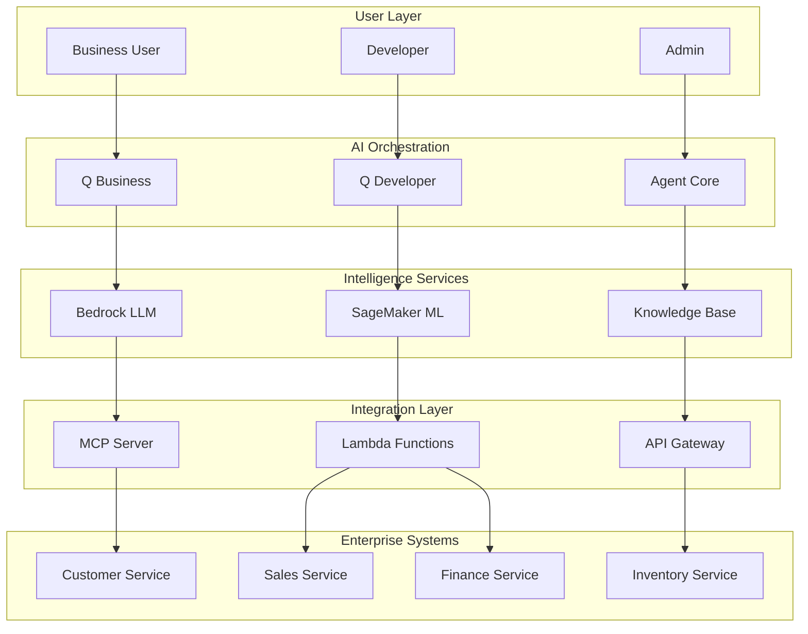
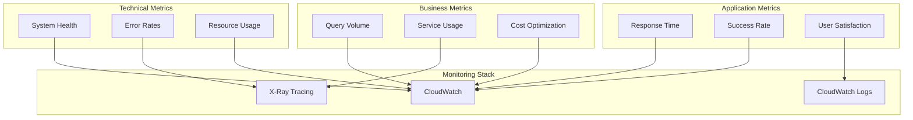
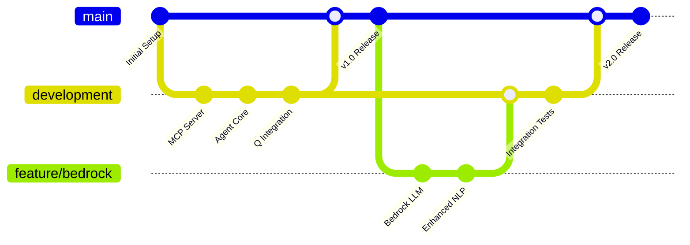
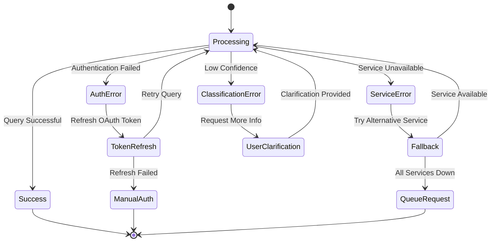
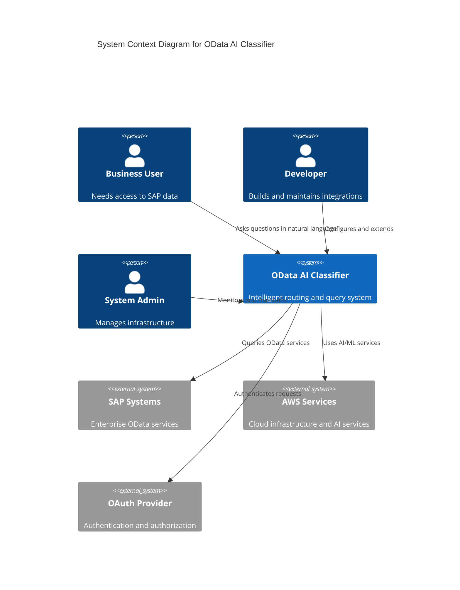

# Architecture Diagrams for OData Service AI Classifier

## 1. MCP Server Integration Flow

## 2. Agent Core Decision Making

## 3. Multi-Service Orchestration

## 4. Data Flow and Security

```mermaid
flowchart LR
    subgraph "Secure Zone"
        A[Encrypted Input] --> B[Authentication]
        B --> C[Authorization]
        C --> D[Data Classification]
    end
    
    subgraph "Processing Zone"
        D --> E[Intent Analysis]
        E --> F[Service Selection]
        F --> G[Query Generation]
    end
    
    subgraph "Integration Zone"
        G --> H[OAuth2 Token]
        H --> I[OData Call]
        I --> J[Response Validation]
    end
    
    subgraph "Response Zone"
        J --> K[Data Sanitization]
        K --> L[Result Formatting]
        L --> M[Encrypted Output]
    end
    
    style A fill:#ff9999
    style M fill:#99ff99
    style H fill:#ffff99
```

## 5. Monitoring and Observability

## 6. Deployment Pipeline

## 7. Error Handling and Recovery

## 8. Scalability Architecture

