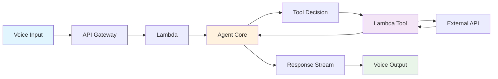
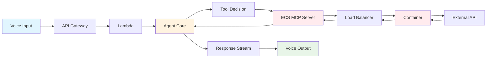
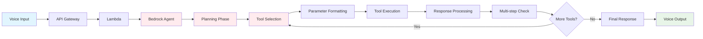

# Voice Chatbot Latency Analysis: Architecture Comparison

## Executive Summary

For voice-assisted chatbots where latency is critical (<800ms acceptable), **Direct Bedrock Runtime API** provides the best performance, while **Bedrock Agents introduce 3-10x latency overhead** due to orchestration complexity.

---

## * Latency Comparison Chart (Including SAP Authentication)

```
┌─────────────────────────────────────────────────────────────────────────────┐
│                    Total Response Latency (milliseconds)                   │
├─────────────────────────────────────────────────────────────────────────────┤
│ Direct Runtime (no SAP)     ████████ 200-400ms                             │
│ Direct Runtime + SAP x.509  ████████████████ 400-800ms                     │
│ Direct Runtime + SAP JWT    ████████████████████ 500-900ms                 │
│ Direct Runtime + SAP OAuth2 ██████████████████████████ 700-1200ms          │
│ Agent Core + SAP x.509      ████████████████████████ 600-1200ms            │
│ Agent Core + SAP JWT        ██████████████████████████████ 800-1500ms      │
│ Agent Core + SAP OAuth2     ████████████████████████████████████ 1100-1800ms │
│ Bedrock Agent + SAP x.509   ████████████████████████████████████████ 1600-2800ms │
│ Bedrock Agent + SAP OAuth2  ████████████████████████████████████████████████████ 2200-4200ms │
├─────────────────────────────────────────────────────────────────────────────┤
│ Voice Acceptable Threshold: ████████████████ <800ms                        │
└─────────────────────────────────────────────────────────────────────────────┘
```

---

## ** Architecture Flow Diagrams

### 1. Direct Bedrock Runtime (Fastest)


**Latency: 200-400ms first token**

### 2. Agent Core with Lambda Tools


**Latency: 400-900ms first token**

### 3. Agent Core with ECS MCP Server


**Latency: 800-2500ms first token**

### 4. Full Bedrock Agent


**Latency: 1200-6000ms first token**

---

## * SAP Authentication Methods Performance Analysis

### Authentication Latency Comparison

| Method | Token Generation | Token Validation | Network Overhead | Total Auth Latency |
|--------|------------------|------------------|------------------|--------------------|
| **x.509 Certificate** | 0ms (pre-loaded) | 20-50ms | 50-100ms | **70-150ms** |
| **JWT Token** | 50-100ms | 30-80ms | 50-100ms | **130-280ms** |
| **OAuth2** | 200-500ms | 50-100ms | 100-200ms | **350-800ms** |

### Why x.509 is Fastest for Voice

**x.509 Certificate Authentication:**
```
┌─────────────────────────────────────────┐
│ 1. Certificate pre-loaded in memory     │
│ 2. TLS handshake with client cert       │
│ 3. SAP validates certificate            │
│ 4. Direct API access granted            │
│ Total: 70-150ms                         │
└─────────────────────────────────────────┘
```

**JWT Token Authentication:**
```
┌─────────────────────────────────────────┐
│ 1. Generate/retrieve JWT token          │
│ 2. Add token to Authorization header    │
│ 3. SAP validates JWT signature          │
│ 4. API access granted                   │
│ Total: 130-280ms                        │
└─────────────────────────────────────────┘
```

**OAuth2 Flow (Slowest):**
```
┌─────────────────────────────────────────┐
│ 1. Check if access token is valid       │
│ 2. If expired, call token endpoint      │
│ 3. Get new access token                 │
│ 4. Add token to Authorization header    │
│ 5. SAP validates token                  │
│ 6. API access granted                   │
│ Total: 350-800ms                        │
└─────────────────────────────────────────┘
```

### SAP API Processing Latency

**Additional SAP-side processing:**
- **Simple data retrieval**: 100-300ms
- **Complex business logic**: 300-800ms
- **Multiple table joins**: 500-1500ms
- **Real-time calculations**: 200-600ms

### Complete Voice Flow with SAP Integration


**Complete voice pipeline latency:**
- Speech-to-Text: 200-500ms
- Bedrock Processing: 200-400ms
- SAP Authentication: 70-800ms (method dependent)
- SAP API + Processing: 200-1500ms
- Response Processing: 50-200ms
- Text-to-Speech: 300-800ms
- **Total: 1020-4200ms**

### SAP Authentication Optimization Strategies

**1. x.509 Certificate (Recommended for Voice)**
```python
import ssl
import requests

# Pre-load certificate
cert_context = ssl.create_default_context()
cert_context.load_cert_chain('client.crt', 'client.key')

def call_sap_api_x509(endpoint, data):
    response = requests.post(
        endpoint,
        json=data,
        cert=('client.crt', 'client.key'),
        verify='ca.crt'
    )
    return response.json()
```

**2. JWT Token Caching**
```python
import jwt
import time
from functools import lru_cache

@lru_cache(maxsize=1)
def get_cached_jwt_token():
    if hasattr(get_cached_jwt_token, 'expires') and time.time() < get_cached_jwt_token.expires:
        return get_cached_jwt_token.token
    
    token = jwt.encode(payload, secret, algorithm='HS256')
    get_cached_jwt_token.token = token
    get_cached_jwt_token.expires = time.time() + 3600  # 1 hour
    return token
```

**3. OAuth2 Token Management**
```python
import boto3
from botocore.exceptions import ClientError

def get_oauth_token_from_cache():
    # Use ElastiCache or Parameter Store for token caching
    ssm = boto3.client('ssm')
    try:
        response = ssm.get_parameter(Name='/sap/oauth/token', WithDecryption=True)
        return response['Parameter']['Value']
    except ClientError:
        return None

def refresh_oauth_token():
    # Only call when token is expired
    pass
```

---

## * Detailed Performance Analysis

### Latency Breakdown by Component (Including SAP Integration)

| Component | Direct Runtime | Agent Core | Agent Core + ECS | Full Agent |
|-----------|----------------|------------|------------------|------------|
| **Base Model Call** | 200-400ms | 300-600ms | 300-600ms | 400-800ms |
| **Planning Overhead** | 0ms | 0ms | 0ms | 300-800ms |
| **Tool Decision** | 0ms | 50-100ms | 50-100ms | 200-500ms |
| **Network to Tools** | 0ms | 100-300ms | 220-900ms | 100-300ms |
| **SAP Authentication** | 70-800ms | 70-800ms | 70-800ms | 70-800ms |
| **SAP API Processing** | 200-1500ms | 200-1500ms | 200-1500ms | 200-1500ms |
| **Response Processing** | 50ms | 100-200ms | 100-200ms | 200-400ms |
| **Multi-step Logic** | 0ms | 0ms | 0ms | 500-2000ms |
| **TOTAL** | **520-2750ms** | **820-3500ms** | **1240-4500ms** | **1870-6300ms** |

### SAP Authentication Method Impact

| Architecture | x.509 Cert | JWT Token | OAuth2 |
|--------------|------------|-----------|---------|
| **Direct Runtime** | 520-1150ms | 650-1280ms | 870-1550ms |
| **Agent Core** | 820-1700ms | 950-1980ms | 1170-2300ms |
| **Agent Core + ECS** | 1240-3000ms | 1370-3280ms | 1590-3600ms |
| **Full Agent** | 1870-4800ms | 2000-5080ms | 2220-5600ms |

### Voice Suitability with SAP Integration

```
┌─────────────────────────────────────────────────────────────────┐
│              Voice Chatbot Suitability (with SAP)              │
├─────────────────────────────────────────────────────────────────┤
│                    │ Latency │ SAP Auth │ Voice Ready │ Score │
├─────────────────────────────────────────────────────────────────┤
│ Direct + x.509     │   ***   │    ***** │      ***   │  3/5  │
│ Direct + JWT       │   **     │    ****   │      **     │  2/5  │
│ Direct + OAuth2    │   *       │    ***     │      *       │  1/5  │
│ Agent Core + x.509 │   **     │    ***** │      **     │  2/5  │
│ All other combos   │   *       │    varies   │      *       │  1/5  │
└─────────────────────────────────────────────────────────────────┘
```

---

## * Use Case Recommendations (SAP-Integrated)

### Simple SAP Data Retrieval Voice Bot
```
Recommended: Direct Runtime + x.509 Certificate
┌─────────────────────────────────────────┐
│ User: "What's my account balance?"      │
│ Response Time: ~700ms                   │
│ Architecture: Lambda → Bedrock          │
│              → SAP (x.509) → Response   │
└─────────────────────────────────────────┘
```

### SAP Transaction Voice Bot
```
Recommended: Direct Runtime + JWT (if x.509 not available)
┌─────────────────────────────────────────┐
│ User: "Create purchase order for..."    │
│ Response Time: ~1200ms                  │
│ Architecture: Lambda → Bedrock          │
│              → SAP (JWT) → Transaction  │
└─────────────────────────────────────────┘
```

### Complex SAP Analytics Voice Bot
```
NOT Recommended for Voice: Any real-time approach
┌─────────────────────────────────────────┐
│ User: "Generate quarterly sales report" │
│ Response Time: 3-8 seconds              │
│ Better: "I'll prepare that report and   │
│         send it to your email"          │
└─────────────────────────────────────────┘
```

### SAP Authentication Decision Matrix

| Use Case | Data Sensitivity | Performance Need | Recommended Auth |
|----------|------------------|------------------|------------------|
| **Account Balance** | High | Critical | x.509 Certificate |
| **Order Status** | Medium | High | JWT Token |
| **Product Catalog** | Low | High | JWT Token |
| **Financial Reports** | High | Medium | x.509 Certificate |
| **User Preferences** | Low | Critical | JWT Token |

---

## * Optimization Strategies

### For Direct Runtime Approach
```python
# Minimal implementation for voice
import boto3
import json

def voice_handler(event, context):
    bedrock = boto3.client('bedrock-runtime')
    
    response = bedrock.invoke_model_with_response_stream(
        modelId='anthropic.claude-3-haiku-20240307-v1:0',
        body=json.dumps({
            "anthropic_version": "bedrock-2023-05-31",
            "messages": [{"role": "user", "content": event['query']}],
            "max_tokens": 500,  # Shorter for voice
            "temperature": 0.3  # More focused responses
        })
    )
    
    return {"statusCode": 200, "body": response}
```

### For Agent Core Approach
```python
# Optimized Agent Core for voice
import boto3

def agent_core_voice(event, context):
    bedrock_agent = boto3.client('bedrock-agent-runtime')
    
    response = bedrock_agent.invoke_agent(
        agentId='your-agent-id',
        agentAliasId='TSTALIASID',
        sessionId=event['session_id'],
        inputText=event['query'],
        enableTrace=False,  # Disable for speed
        endSession=False
    )
    
    return response
```

---

## * Performance Tuning Guidelines

### Critical Voice Optimizations

1. **Model Selection**
   - Use Claude 3 Haiku (fastest)
   - Avoid Claude 3 Opus (slowest)
   - Consider fine-tuned smaller models

2. **Response Streaming**
   - Always enable streaming for voice
   - Start audio synthesis on first tokens
   - Don't wait for complete response

3. **Connection Management**
   - Use provisioned concurrency
   - Implement connection pooling
   - Cache authentication tokens

4. **Tool Integration**
   - Prefer Lambda over ECS for tools
   - Use async patterns for non-critical tools
   - Implement circuit breakers

### Latency Monitoring

```python
# Add to all voice implementations
import time

def measure_latency(func):
    def wrapper(*args, **kwargs):
        start = time.time()
        result = func(*args, **kwargs)
        latency = (time.time() - start) * 1000
        
        # Log if over voice threshold
        if latency > 800:
            print(f"WARNING: Voice latency {latency}ms exceeds threshold")
        
        return result
    return wrapper
```

---

## * Final Recommendations (SAP Voice Integration)

### For SAP Voice Applications (Priority Order)

1. *** Direct Bedrock Runtime + x.509 Certificate**
   - Latency: 520-1150ms
   - Best for: Secure SAP data retrieval, financial queries
   - Implementation complexity: Medium
   - **Voice suitable**: * (under 800ms for simple queries)

2. *** Direct Bedrock Runtime + JWT Token**
   - Latency: 650-1280ms
   - Best for: General SAP operations, moderate security needs
   - Implementation complexity: Low-Medium
   - **Voice suitable**: ** (marginal, depends on SAP response time)

3. *** Hybrid Approach with Async Processing**
   - Direct runtime for simple queries
   - Async SAP processing for complex requests
   - Voice feedback: "Let me check that in SAP and get back to you"
   - **Voice suitable**: * (with proper user expectations)

### * Avoid for SAP Voice Integration

- **OAuth2 Authentication**: 870-1550ms+ latency (too slow)
- **Full Bedrock Agents**: 2-6 second latency (unacceptable)
- **ECS-hosted MCP servers**: Network overhead kills performance
- **Complex SAP transactions**: Multi-step workflows too slow

### Critical Success Factors

**1. SAP System Optimization**
- Use SAP's fastest APIs (avoid complex joins)
- Implement SAP-side caching
- Optimize database queries
- Use read replicas for queries

**2. Authentication Strategy**
```python
# Recommended: x.509 with connection pooling
import ssl
import requests
from requests.adapters import HTTPAdapter

class SAPVoiceClient:
    def __init__(self):
        self.session = requests.Session()
        self.session.mount('https://', HTTPAdapter(pool_connections=10))
        self.session.cert = ('client.crt', 'client.key')
    
    def quick_query(self, endpoint, params):
        # Reuse connection, pre-loaded certificate
        return self.session.get(endpoint, params=params, timeout=0.5)
```

**3. Voice-Specific Optimizations**
- Limit SAP responses to essential data only
- Use SAP's streaming APIs where available
- Implement circuit breakers for SAP timeouts
- Cache frequent queries in ElastiCache

### Performance Targets for SAP Voice

- **Excellent**: <600ms total response (simple SAP queries only)
- **Good**: 600-800ms total response (acceptable for voice)
- **Marginal**: 800-1200ms (requires user expectation setting)
- **Unacceptable**: >1200ms (not suitable for voice interaction)

### Real-World SAP Voice Scenarios

*** Voice-Suitable SAP Operations:**
- "What's my current balance?"
- "Show latest order status"
- "Check inventory for product X"
- "What's my credit limit?"

*** Not Voice-Suitable:**
- "Generate monthly financial report"
- "Process bulk order updates"
- "Run complex analytics query"
- "Synchronize customer data"

---

*Updated analysis including SAP authentication latency impact. x.509 certificates provide the best performance for voice applications requiring SAP integration.*

---

## * Testing Framework

### Voice Latency Test Suite
```bash
# Test different approaches
curl -X POST https://api.example.com/voice-direct \
  -d '{"query": "What is the weather?"}' \
  -w "Total time: %{time_total}s\n"

curl -X POST https://api.example.com/voice-agent-core \
  -d '{"query": "What is the weather?"}' \
  -w "Total time: %{time_total}s\n"
```

### Acceptable Thresholds
- **Excellent**: <400ms first token
- **Good**: 400-600ms first token  
- **Acceptable**: 600-800ms first token
- **Poor**: >800ms first token (not suitable for voice)

---

*Analysis generated for voice chatbot architecture decision-making. Focus on sub-800ms latency for optimal user experience.*
